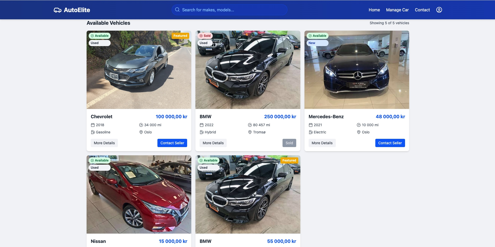
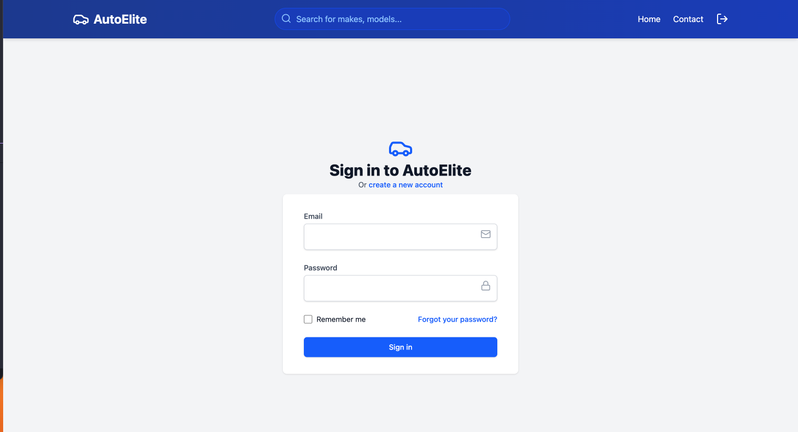
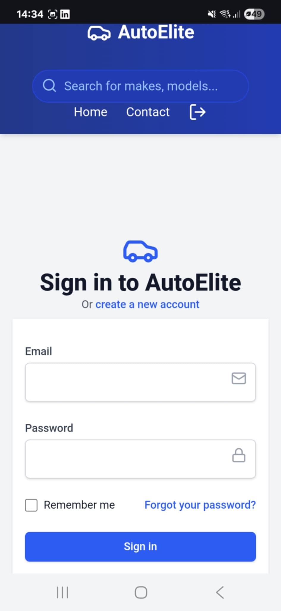
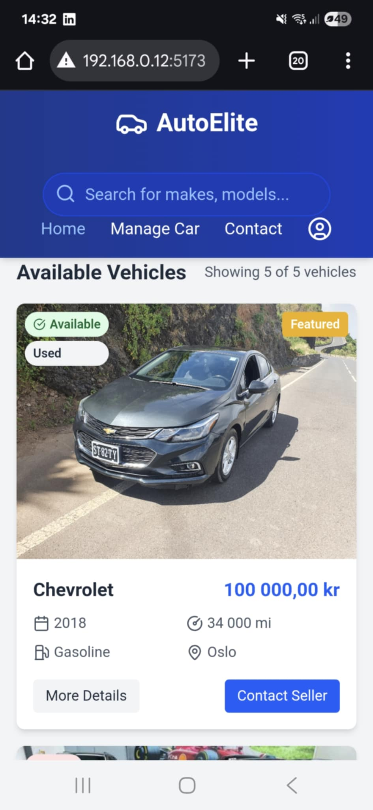
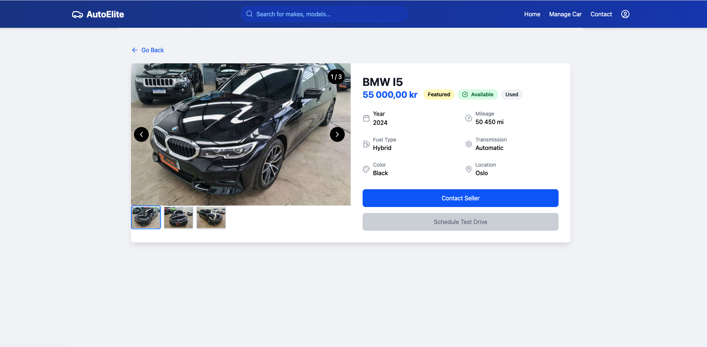
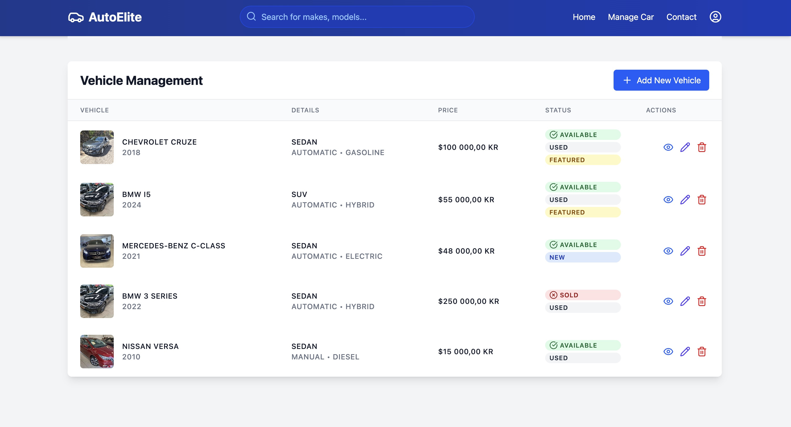
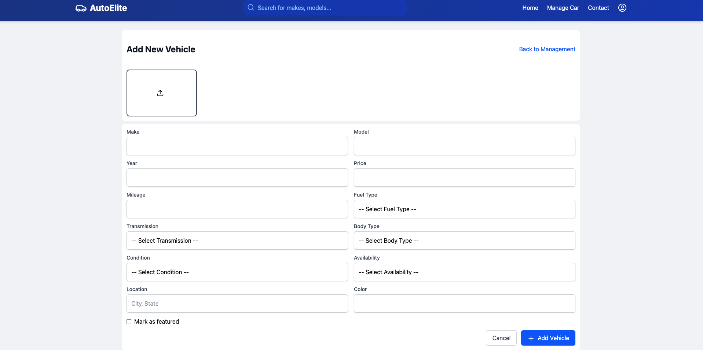

# AutoElite

Uma plataforma intuitiva, moderna e completamente responsiva para a gestão e visualização de veículos à venda!

- https://auto-elite-lime.vercel.app/



## Funcionalidades:

## Ferramentas: 

- [React.js](https://reactjs.org/) - Biblioteca JavaScript para construção de interfaces
- [React Router Dom](https://reactrouter.com/)- Gerenciamento de rotas
- [React Hot Toast](https://react-hot-toast.com/) - Sistema de notificações e alertas
- [TailwindCSS](https://tailwindcss.com/) - Framework CSS para estilização
- [TypeScript](https://www.typescriptlang.org/) - Superset JavaScript para tipagem estática
- [Vite](https://vitejs.dev/) - Build tool e ambiente de desenvolvimento rápido para projetos JavaScript
- [Lucide React](https://lucide.dev/guide/packages/lucide-react) - Biblioteca de ícones para React
- [Axios](https://axios-http.com/docs/intro) - Cliente HTTP baseado em Promises para fazer requisições

- [Firebase(Auth, Storage, Database) ](https://firebase.google.com/) - Autenticação, banco de dados e armazenamento de arquivos em tempo real

## Tecnologias Utilizadas:


## 🖥️ Como executar o projeto

1. Clone o repositório:
  ```bash
  https://github.com/Leonildo-Gomes/auto-elite.git
  ```

2. Instale as dependências:
  ```bash
  cd auto-elite
  npm install
  ```

3. Execute o projeto:
  ```bash
  npm run dev
  ```

4.Configure as variáveis de ambiente:
  - Crie um arquivo .env na raiz do projecto a adicione as seguintes variaveis de ambiente do firebase:
  ```bash
  VITE_FIREBASE_API_KEY= 
  VITE_FIREBASE_AUTH_DOMAIN= 
  VITE_FIREBASE_PROJECT_ID= 
  VITE_FIREBASE_STORAGE_BUCKET= 
  VITE_FIREBASE_MESSAGING_SENDER_ID= 
  VITE_FIREBASE_APP_ID=
  ```
  - certifique -se de subsituir os valores de exemplo pelas informacoes do seu projeto Firebase
A aplicação estará disponível em: `http://localhost:5173`

## Funcionalidads:

 - Listagem de Carros
 - Cadastro de Carros
 - Login e Cadastro de Utilizador
 - Gestao de Carros


## 📂 Estrutura do Projeto

```
 src/
 ├── components/
 │   ├── header/
 │   ├── layout/
 │   ├── carCard/
 │   ├── carList/
 │   ├── footer/
 │   ├── filterSection/
 │   ├── container/
 │   ├── input/
 │   ├── selectInput/
 │   └── tableColumn/
 ├── context/
 │   ├── AuthContext.tsx
 │   └── AuthProvider.tsx
 ├── pages/
 │   ├── home/
 │   ├── car/
 │   ├── login/
 │   ├── register/
 │   ├── manageCar/
 │   ├── dashboard/
 │   └── notFound/
 ├── services/
 │   └── firebaseConnection
 ├── routes/
 │   ├── router
 │   └── Private
 ├── types/
 │   └── index.tsx
 └── App.tsx
 ```










